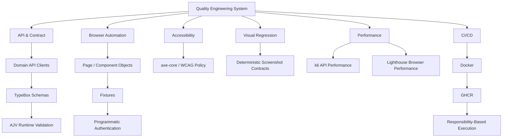

# Quality Engineering Showcase

> A Senior SDET / Quality Engineering case study demonstrating how I design maintainable, reproducible, and scalable quality engineering systems.

This showcase presents the architecture, implementation patterns, execution model, engineering decisions, and evolution of a **Playwright + TypeScript Quality Engineering framework**.

The focus goes beyond writing automated tests. It demonstrates how different quality concerns can be designed as a coherent engineering system with clear ownership, deterministic setup, runtime validation, reproducible execution, CI/CD integration, actionable quality signals, and failure diagnostics.

### Implemented

**API & Contract · UI · Cross-Browser · Accessibility · Visual Regression · Performance · Docker · CI/CD**

### Technology

**Playwright · TypeScript · Node.js · TypeBox · AJV · axe-core · Docker · GitHub Actions · GHCR · k6 · Lighthouse**

### Engineering Roadmap

**Data & Cloud → AI-Assisted QA → AI QA Platforms → QE & Leadership → System Design, Security & Observability**

**[Explore the portfolio site →](https://szabihudak.github.io/quality-engineering-showcase/)** · [Architecture](#architecture-at-a-glance) · [Evidence](#execution-evidence) · [Roadmap](#framework-roadmap)

---

## What This Project Demonstrates

The underlying framework is developed as an **automation engineering system rather than a collection of test scripts**.

Current implementation demonstrates:

- API and browser automation with Playwright;
- schema-first API contracts with TypeBox and AJV runtime validation;
- Page Object and Component Object architecture;
- reusable fixtures and deterministic test-data factories;
- programmatic API and browser authentication;
- API-driven test setup and network mocking;
- Chromium, Firefox, and WebKit execution;
- automated accessibility testing with axe-core;
- deterministic visual regression testing;
- API performance testing with k6;
- browser performance testing with Lighthouse;
- reproducible Docker execution;
- responsibility-based GitHub Actions CI/CD;
- GHCR image reuse across CI jobs;
- reports and failure diagnostics;
- documented engineering standards and architectural decisions.

The engineering roadmap extends the portfolio into data and cloud foundations, AI-assisted Quality Engineering, AI-native testing platforms, QE strategy and leadership, system design, security, and observability.

---

## Capability Map

| Capability | Status | Public Representation |
| --- | --- | --- |
| API automation | ✅ Implemented | Canonical source · [execution evidence](docs/showcases/api/README.md) |
| Runtime contract validation | ✅ Implemented | Canonical source · [execution evidence](docs/showcases/api/README.md) |
| UI automation | ✅ Implemented | Canonical source · [execution evidence](docs/showcases/ui/README.md) |
| Cross-browser execution | ✅ Implemented | Canonical source · architecture · [execution evidence](docs/showcases/ui/README.md) |
| Programmatic authentication | ✅ Implemented | Canonical source |
| Deterministic test data | ✅ Implemented | Canonical source |
| Network mocking | ✅ Implemented | Canonical source |
| Accessibility testing | ✅ Implemented | Architecture · [execution evidence](docs/showcases/accessibility/README.md) |
| Visual regression | ✅ Implemented | Architecture · [execution evidence](docs/showcases/visual-regression/README.md) |
| API performance | ✅ Implemented | Architecture · [performance evidence](docs/showcases/performance/README.md) |
| Browser performance | ✅ Implemented | Architecture · [performance evidence](docs/showcases/performance/README.md) |
| Docker execution | ✅ Implemented | Architecture · dedicated public execution evidence deferred |
| GitHub Actions CI/CD | ✅ Implemented | CI/CD architecture · dedicated public execution evidence deferred |
| GHCR image reuse | ✅ Implemented | CI/CD architecture · dedicated public execution evidence deferred |
| SQL & data foundations | ◇ Planned | Roadmap |
| AWS & cloud foundations | ◇ Planned | Roadmap |
| AI-assisted QA workflow | ◇ Planned | Roadmap |
| AI QA platform evaluation | ◇ Planned | Roadmap |
| QE strategy & leadership | ◇ Planned | Roadmap |
| System design & security | ◇ Planned | Roadmap |
| Observability foundations | ◇ Planned | Roadmap |

> **Implementation status is evidence-based.** A capability is marked as implemented only when it exists in the canonical framework and can be supported by verified implementation or execution evidence. Dedicated public execution-evidence publication is tracked separately and may intentionally be deferred. Roadmap capabilities are explicitly presented as planned work.

---

## Architecture at a Glance



The architecture separates **test behavior from reusable infrastructure** and assigns execution according to testing responsibility.

This means the framework does not simply execute every test through every available runtime.

For example:

```text
API
→ browser independent
→ execute once

UI
→ browser-dependent behavior
→ Chromium / Firefox / WebKit

Accessibility
→ dedicated quality responsibility
→ Chromium

Visual Regression
→ deterministic rendering
→ canonical Docker/Linux environment

API Performance
→ k6

Browser Performance
→ Lighthouse
```

[Explore the architecture →](docs/ARCHITECTURE.md)

---

## Execution Evidence

The public showcase includes **reviewed evidence from real executions of the canonical framework**.

Published evidence currently covers:

- API and runtime contract validation;
- Chromium, Firefox, and WebKit UI execution;
- automated accessibility analysis;
- deterministic visual regression;
- k6 API performance;
- public Lighthouse CI execution;
- authenticated Playwright + Lighthouse execution;
- reports, screenshots, visual baselines, and failure diagnostics.

### API & Contract

**28 / 28 tests passed**

The published API evidence demonstrates authentication, runtime contract validation, validation behavior, negative paths, and deterministic test data.

[Inspect API execution evidence →](docs/showcases/api/README.md)

### UI & Cross-Browser

**18 / 18 tests passed**

The same browser scenarios execute across Chromium, Firefox, and WebKit, with six passing tests per browser engine.

[Inspect UI execution evidence →](docs/showcases/ui/README.md)

### Accessibility

The accessibility quality gate detected **two real product accessibility issues** rather than converting the run into an artificial green result.

The selected evidence includes serious `color-contrast` violations with an observed contrast ratio of **3.81:1** against the required **4.5:1**.

[Inspect accessibility evidence →](docs/showcases/accessibility/README.md)

### Visual Regression

**2 / 2 visual tests passed** against approved Linux baselines.

The published evidence demonstrates deterministic application state, controlled rendering, full-page and component-level screenshot comparison, and explicit baseline ownership.

[Inspect visual regression evidence →](docs/showcases/visual-regression/README.md)

### Performance

Performance responsibility is separated into API workload and browser-observed measurement.

Published evidence includes:

```text
k6 API workload
→ 2 VUs / 30 seconds
→ 52 iterations
→ 56 / 56 checks
→ 0% failures
→ p95 257.33 ms

Public Lighthouse CI
→ 3 runs
→ canonical LHCI assertions
→ execution completed without assertion failure

Authenticated Lighthouse
→ Playwright-established authenticated state
→ 3 independent audits
→ median aggregation for portfolio reporting
```

Standalone Lighthouse CI assertions and portfolio median summaries are intentionally treated as different concepts. The median summaries do not represent Lighthouse CI's assertion algorithm.

[Inspect performance evidence →](docs/showcases/performance/README.md)

### Failure Diagnostics

A selected accessibility failure is preserved as a diagnostic case study.

The evidence demonstrates that a failed quality gate is not automatically a framework regression. Reports and artifacts are used to distinguish product defects from framework, environment, infrastructure, external-platform, and known-product-issue domains.

[Inspect diagnostic evidence →](docs/showcases/diagnostics/README.md)

> Docker, GitHub Actions, and GHCR are implemented parts of the canonical engineering system. Their architecture is documented publicly; a dedicated sanitized public CI/CD / Docker / GHCR execution-evidence package is intentionally deferred.

---

## Selected Engineering Highlights

### Schema-First Runtime Contracts

Compile-time TypeScript types do not prove that an external provider actually returned the expected structure.

The API layer therefore validates successful provider responses at runtime before test code trusts the returned data.

```text
HTTP Response
      ↓
Status Assertion
      ↓
Parse Response
      ↓
AJV Runtime Validation
      ↓
Typed Business Assertions
```

TypeBox provides the schema/type relationship while AJV validates the actual runtime response.

---

### Deterministic Test Architecture

Test setup favors reusable fixtures, deterministic factories, and API-driven initialization when browser interaction is not the behavior under test.

```text
Scenario
   ↓
Fixture
   ↓
Factory
   ↓
API / Authentication Setup
   ↓
Deterministic Application State
   ↓
Behavior Under Test
```

The objective is to keep tests focused on the behavior they own while reusable infrastructure manages setup and lifecycle concerns.

---

### Explicit Execution Ownership

Execution scope follows the responsibility being tested.

Browser-independent API coverage is not multiplied across browser engines. UI behavior owns cross-browser execution. Accessibility and visual regression have dedicated execution boundaries.

Performance testing uses the runtime appropriate to the measurement responsibility:

```text
API workload performance
→ k6

Browser-observed performance
→ Lighthouse
```

This avoids unnecessary execution while keeping quality ownership explicit.

---

### Reproducible Visual Testing

Visual regression uses:

- deterministic application state;
- native Playwright screenshot assertions;
- version-controlled approved baselines;
- explicit baseline review;
- a canonical Docker/Linux rendering environment.

CI compares against approved baselines. It does not automatically approve rendering changes.

---

### Reuse Before New Abstraction

When deterministic setup already exists in the functional framework, additional quality coverage reuses that setup instead of creating parallel business-state initialization.

The authenticated Lighthouse path follows this principle:

```text
existing deterministic setup
        ↓
authenticated application state
        ↓
representative page state
        ↓
Lighthouse measurement
```

The measurement layer changes. The business-state initialization does not.

---

### Build Once, Run Many

The main Playwright CI pipeline builds one reusable Docker image and publishes it to GHCR under the current commit SHA.

Downstream execution responsibilities reuse that exact image.

```text
quality
   ↓
build image once
   ↓
GHCR : commit SHA
   ↓
   ├── API
   ├── Accessibility
   ├── Visual Regression
   └── UI Browser Matrix
```

This separates the reusable execution environment from the Playwright project responsible for deciding what executes.

[Explore the engineering decisions →](docs/ENGINEERING_DECISIONS.md)

---

## CI/CD at a Glance

The main CI dependency model is:

```text
quality
├── formatting
└── typecheck
        ↓
build-image
        ↓
push immutable commit-SHA image to GHCR
        ↓
        ├── API
        ├── Accessibility
        ├── Visual Regression
        └── UI Browser Matrix
              ├── Chromium
              ├── Firefox
              └── WebKit
```

The downstream Playwright responsibilities reuse the same container image rather than rebuilding separate environments for individual test projects.

Performance execution is owned separately:

```text
Performance Workflow
├── k6 API Performance
└── Browser Performance
    ├── Standalone Lighthouse
    └── Authenticated Playwright + Lighthouse
```

The current hosted performance workflow is intentionally separate from normal push and pull-request execution because the target application is shared infrastructure rather than an isolated load-test environment.

The CI/CD, Docker, and GHCR implementation is documented publicly. Dedicated sanitized public execution evidence for this infrastructure layer is intentionally deferred.

[Explore the CI/CD architecture →](docs/CI_CD.md)

---

## Selected Source

This repository is intentionally **not a public mirror of the complete framework**.

The core API and UI automation architecture is published here as **public-safe canonical source**, copied directly from the verified private implementation without showcase-specific rewrites.

The published source includes:

```text
config/
└── environments/

src/
├── accessibility/   # shared canonical dependencies used by the published fixture layer
├── api/
├── components/
├── data/
├── fixtures/
├── mocks/
├── pages/
└── utils/

tests/
├── api/
├── smoke/
└── ui/
```

This source demonstrates:

- domain API client design;
- TypeBox contracts and AJV runtime validation;
- Page Object and Component Object boundaries;
- fixture composition and programmatic authentication;
- deterministic test-data factories;
- network mocking;
- API, smoke, and cross-browser UI test design;
- environment-aware configuration.

Public representation intentionally differs by capability:

```text
API / UI / Cross-Browser
→ selected public-safe canonical source
→ architecture
→ real sanitized execution evidence

Accessibility / Visual Regression / Performance
→ architecture
→ real sanitized execution evidence

Docker / GitHub Actions / GHCR
→ implemented canonical architecture
→ public architecture documentation
→ dedicated sanitized execution-evidence publication deferred
```

Source publication remains deliberately selective.

The goal is to make the **core API and UI architecture fully inspectable** while demonstrating broader Quality Engineering capability without publishing the complete canonical framework or creating a parallel framework that must be maintained independently.

---

## Framework Roadmap

The portfolio is designed to evolve alongside the broader Quality Engineering roadmap.

### ✅ Implemented — Automation Engineering Foundation

```text
Core Framework Architecture
        ↓
API & Contract Testing
        ↓
CI/CD
        ↓
Docker & Reproducible Execution
        ↓
Accessibility
        ↓
Visual Regression
        ↓
Performance Testing
```

Current implementation includes API/UI automation, runtime contract validation, deterministic data and fixtures, authentication, mocking, cross-browser execution, accessibility, visual regression, k6, Lighthouse, Docker, GitHub Actions, GHCR, and execution diagnostics.

### ◇ Next — Data & Cloud Foundations

Planned areas include:

- SQL;
- JOINs;
- GROUP BY and aggregation;
- window functions;
- query analysis;
- AWS fundamentals;
- IAM;
- S3;
- CloudWatch;
- secrets management.

### ◇ Planned — AI-Assisted Quality Engineering

Planned areas include:

- GitHub Copilot;
- Cursor;
- ChatGPT-assisted QA workflows;
- AI-assisted test generation;
- AI-assisted debugging;
- prompt engineering;
- OpenAI API fundamentals.

### ◇ Planned — Modern AI QA Platforms

Planned areas include:

- AI-native testing platforms;
- self-healing approaches;
- AI-assisted regression testing;
- platform evaluation;
- proof-of-concept implementation.

### ◇ Planned — Quality Engineering & Leadership

Planned areas include:

- test strategy;
- risk-based testing;
- test pyramid;
- shift-left / shift-right;
- quality metrics;
- flaky-test analysis;
- defect leakage;
- MTTD / MTTR;
- mentoring;
- stakeholder management;
- technical communication.

### ◇ Planned — System Design, Security & Observability

Planned areas include:

- QA system design;
- microservices testing;
- distributed-system testing concepts;
- OWASP Top 10 fundamentals;
- observability;
- logging;
- Grafana / Kibana fundamentals.

[Explore the complete roadmap →](docs/ROADMAP.md)

---

## Deep Technical Documentation

The README provides the fast path through the project.

Technical interviewers and engineering reviewers can continue into focused deep dives:

| Document | Focus |
| --- | --- |
| [Architecture](docs/ARCHITECTURE.md) | Framework boundaries, dependency model, execution ownership |
| [CI/CD](docs/CI_CD.md) | Docker, GHCR, workflow responsibilities and execution model |
| [Engineering Decisions](docs/ENGINEERING_DECISIONS.md) | Architectural choices, reasoning and trade-offs |
| [Testing Standards](docs/TESTING_STANDARDS.md) | Selected public Quality Engineering standards |
| [Roadmap](docs/ROADMAP.md) | Implemented capabilities and future engineering direction |

These documents are **curated public representations**, not copies of the complete private framework documentation.

---

## Technology Stack

### Implemented

**Playwright · TypeScript · Node.js · TypeBox · AJV · axe-core · Docker · GitHub Actions · GHCR · k6 · Lighthouse**

### Roadmap

**SQL · AWS · AI-assisted QA tooling · AI QA platforms · security and observability tooling**

Roadmap technologies represent planned areas of engineering development and are not presented as completed framework integrations.

---

## About This Showcase

This repository is a **curated public Quality Engineering case study**.

The complete implementation is maintained separately as the canonical engineering source of truth.

The public showcase combines:

```text
Selected Implementation
        +
Architecture
        +
Engineering Decisions
        +
Real Execution Evidence
        +
Portfolio Presentation
        +
Engineering Roadmap
```

Every implemented capability presented here must be backed by verified implementation.

Every execution result presented here must come from real framework execution and pass a public-safety review.

Future capabilities remain explicitly identified as roadmap work until they are implemented and validated.

The objective is not to expose the largest possible amount of source code.

It is to make the **engineering system, implementation quality, design decisions, evidence, and evolution of the Quality Engineering approach** easy to evaluate.

---

## Portfolio Site

The GitHub Pages presentation layer provides the fast visual path through the same engineering system:

**[Open the Quality Engineering Showcase →](https://szabihudak.github.io/quality-engineering-showcase/)**

It is designed for progressive depth:

```text
Portfolio overview
        ↓
Capability pages
        ↓
Architecture / CI/CD / Decisions
        ↓
Real execution evidence
        ↓
Selected canonical source
```