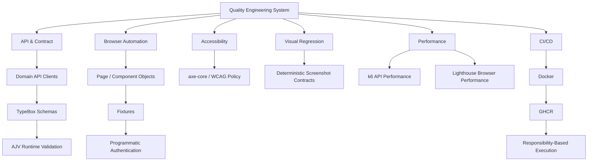

# Quality Engineering Showcase

> A Senior SDET / Quality Engineering case study demonstrating how I design maintainable, reproducible, and scalable quality engineering systems.

This showcase presents the architecture, implementation patterns, execution model, engineering decisions, and evolution of a **Playwright + TypeScript Quality Engineering framework**.

The focus goes beyond writing automated tests. It demonstrates how different quality concerns can be designed as a coherent engineering system with clear ownership, deterministic setup, runtime validation, reproducible execution, CI/CD integration, actionable quality signals, and failure diagnostics.

### Implemented

**API & Contract · UI · Cross-Browser · Accessibility · Visual Regression · Performance · Docker · CI/CD**

### Technology

**Playwright · TypeScript · Node.js · TypeBox · AJV · axe-core · Docker · GitHub Actions · GHCR · k6 · Lighthouse**

### Engineering Roadmap

**Data & Cloud → AI-Assisted QA → AI QA Platforms → QE & Leadership → System Design, Security & Observability**

**Full Framework Demo — in preparation** · [Architecture](#architecture-at-a-glance) · [Roadmap](#framework-roadmap)

---

## What This Project Demonstrates

The underlying framework is developed as an **automation engineering system rather than a collection of test scripts**.

Current implementation demonstrates:

- API and browser automation with Playwright;
- schema-first API contracts with TypeBox and AJV runtime validation;
- Page Object and Component Object architecture;
- reusable fixtures and deterministic test-data factories;
- programmatic API and browser authentication;
- API-driven test setup and network mocking;
- Chromium, Firefox, and WebKit execution;
- automated accessibility testing with axe-core;
- deterministic visual regression testing;
- API performance testing with k6;
- browser performance testing with Lighthouse;
- reproducible Docker execution;
- responsibility-based GitHub Actions CI/CD;
- GHCR image reuse across CI jobs;
- reports and failure diagnostics;
- documented engineering standards and architectural decisions.

The engineering roadmap extends the portfolio into data and cloud foundations, AI-assisted Quality Engineering, AI-native testing platforms, QE strategy and leadership, system design, security, and observability.

---

## Capability Map

| Capability | Status | Demonstrated Through |
| --- | --- | --- |
| Automation architecture | ✅ Implemented | Architecture + selected implementation |
| API automation | ✅ Implemented | Selected source + execution evidence |
| Runtime contract validation | ✅ Implemented | TypeBox + AJV |
| UI automation | ✅ Implemented | Selected source + execution evidence |
| Programmatic authentication | ✅ Implemented | Architecture + curated example |
| Deterministic test data | ✅ Implemented | Factory / fixture pattern |
| Network mocking | ✅ Implemented | Selected example |
| Cross-browser execution | ✅ Implemented | Chromium / Firefox / WebKit |
| Accessibility testing | ✅ Implemented | Architecture + execution evidence |
| Visual regression | ✅ Implemented | Architecture + visual evidence |
| API performance | ✅ Implemented | k6 |
| Browser performance | ✅ Implemented | Lighthouse |
| Docker execution | ✅ Implemented | Execution architecture |
| GitHub Actions CI/CD | ✅ Implemented | Pipeline architecture |
| GHCR image reuse | ✅ Implemented | CI/CD architecture |
| SQL & data foundations | ◇ Planned | Roadmap |
| AWS & cloud foundations | ◇ Planned | Roadmap |
| AI-assisted QA workflow | ◇ Planned | Roadmap |
| AI QA platform evaluation | ◇ Planned | Roadmap |
| QE strategy & leadership | ◇ Planned | Roadmap |
| System design & security | ◇ Planned | Roadmap |
| Observability foundations | ◇ Planned | Roadmap |

> **Implementation status is evidence-based.** A capability is marked as implemented only when it exists in the canonical framework and can be supported by real implementation or execution evidence. Roadmap capabilities are explicitly presented as planned work.

---

## Architecture at a Glance



The architecture separates **test behavior from reusable infrastructure** and assigns execution according to testing responsibility.

This means the framework does not simply execute every test through every available runtime.

For example:

```text
API
→ browser independent
→ execute once

UI
→ browser-dependent behavior
→ Chromium / Firefox / WebKit

Accessibility
→ dedicated quality responsibility
→ Chromium

Visual Regression
→ deterministic rendering
→ canonical Docker/Linux environment

API Performance
→ k6

Browser Performance
→ Lighthouse
```

[Explore the architecture →](docs/ARCHITECTURE.md)

---

## Full Framework Demo

A public-safe static demo will provide **real execution evidence from the canonical framework**.

It will bring together representative evidence for:

- API and runtime contract validation;
- Chromium, Firefox, and WebKit UI execution;
- automated accessibility analysis;
- visual regression;
- k6 API performance;
- Lighthouse browser performance;
- CI/CD execution;
- reports and failure diagnostics.

The demo is designed as an engineering case study rather than a raw CI log viewer.

It will use reviewed and sanitized evidence from real executions. Results, metrics, screenshots, and reports will not be fabricated for presentation purposes.

> **Full Framework Demo — in preparation**

---

## Selected Engineering Highlights

### Schema-First Runtime Contracts

Compile-time TypeScript types do not prove that an external provider actually returned the expected structure.

The API layer therefore validates successful provider responses at runtime before test code trusts the returned data.

```text
HTTP Response
      ↓
Status Assertion
      ↓
Parse Response
      ↓
AJV Runtime Validation
      ↓
Typed Business Assertions
```

TypeBox provides the schema/type relationship while AJV validates the actual runtime response.

---

### Deterministic Test Architecture

Test setup favors reusable fixtures, deterministic factories, and API-driven initialization when browser interaction is not the behavior under test.

```text
Scenario
   ↓
Fixture
   ↓
Factory
   ↓
API / Authentication Setup
   ↓
Deterministic Application State
   ↓
Behavior Under Test
```

The objective is to keep tests focused on the behavior they own while reusable infrastructure manages setup and lifecycle concerns.

---

### Explicit Execution Ownership

Execution scope follows the responsibility being tested.

Browser-independent API coverage is not multiplied across browser engines. UI behavior owns cross-browser execution. Accessibility and visual regression have dedicated execution boundaries.

Performance testing uses the runtime appropriate to the measurement responsibility:

```text
API workload performance
→ k6

Browser-observed performance
→ Lighthouse
```

This avoids unnecessary execution while keeping quality ownership explicit.

---

### Reproducible Visual Testing

Visual regression uses:

- deterministic application state;
- native Playwright screenshot assertions;
- version-controlled approved baselines;
- explicit baseline review;
- a canonical Docker/Linux rendering environment.

CI compares against approved baselines. It does not automatically approve rendering changes.

---

### Reuse Before New Abstraction

When deterministic setup already exists in the functional framework, additional quality coverage reuses that setup instead of creating parallel business-state initialization.

The authenticated Lighthouse path follows this principle:

```text
existing deterministic setup
        ↓
authenticated application state
        ↓
representative page state
        ↓
Lighthouse measurement
```

The measurement layer changes. The business-state initialization does not.

---

### Build Once, Run Many

The main Playwright CI pipeline builds one reusable Docker image and publishes it to GHCR under the current commit SHA.

Downstream execution responsibilities reuse that exact image.

```text
quality
   ↓
build image once
   ↓
GHCR : commit SHA
   ↓
   ├── API
   ├── Accessibility
   ├── Visual Regression
   └── UI Browser Matrix
```

This separates the reusable execution environment from the Playwright project responsible for deciding what executes.

[Explore the engineering decisions →](docs/ENGINEERING_DECISIONS.md)

---

## CI/CD at a Glance

The main CI dependency model is:

```text
quality
├── formatting
└── typecheck
        ↓
build-image
        ↓
push immutable commit-SHA image to GHCR
        ↓
        ├── API
        ├── Accessibility
        ├── Visual Regression
        └── UI Browser Matrix
              ├── Chromium
              ├── Firefox
              └── WebKit
```

The downstream Playwright responsibilities reuse the same container image rather than rebuilding separate environments for individual test projects.

Performance execution is owned separately:

```text
Performance Workflow
├── k6 API Performance
└── Browser Performance
    ├── Standalone Lighthouse
    └── Authenticated Playwright + Lighthouse
```

The current hosted performance workflow is intentionally separate from normal push and pull-request execution because the target application is shared infrastructure rather than an isolated load-test environment.

[Explore the CI/CD architecture →](docs/CI_CD.md)

---

## Selected Source

This repository is intentionally **not a public mirror of the complete framework**.

Instead, selected public-safe examples are used to demonstrate representative engineering patterns.

The showcase is designed to include examples such as:

```text
examples/
├── api-contract/
├── ui/
├── fixtures/
├── accessibility/
├── visual/
└── performance/
```

Representative material may demonstrate:

- domain API client design;
- TypeBox contracts;
- AJV runtime validation;
- Page Object / Component Object boundaries;
- fixture composition;
- deterministic test-data factories;
- public-safe authentication architecture;
- network mocking;
- representative API and UI tests;
- accessibility patterns;
- visual regression patterns;
- performance-testing patterns.

Source publication is deliberately selective.

The goal is to demonstrate **architecture, implementation quality, and engineering reasoning** without creating a second independently maintained copy of the canonical framework.

---

## Framework Roadmap

The portfolio is designed to evolve alongside the broader Quality Engineering roadmap.

### ✅ Implemented — Automation Engineering Foundation

```text
Core Framework Architecture
        ↓
API & Contract Testing
        ↓
CI/CD
        ↓
Docker & Reproducible Execution
        ↓
Accessibility
        ↓
Visual Regression
        ↓
Performance Testing
```

Current implementation includes API/UI automation, runtime contract validation, deterministic data and fixtures, authentication, mocking, cross-browser execution, accessibility, visual regression, k6, Lighthouse, Docker, GitHub Actions, GHCR, and execution diagnostics.

### ◇ Next — Data & Cloud Foundations

Planned areas include:

- SQL;
- JOINs;
- GROUP BY and aggregation;
- window functions;
- query analysis;
- AWS fundamentals;
- IAM;
- S3;
- CloudWatch;
- secrets management.

### ◇ Planned — AI-Assisted Quality Engineering

Planned areas include:

- GitHub Copilot;
- Cursor;
- ChatGPT-assisted QA workflows;
- AI-assisted test generation;
- AI-assisted debugging;
- prompt engineering;
- OpenAI API fundamentals.

### ◇ Planned — Modern AI QA Platforms

Planned areas include:

- AI-native testing platforms;
- self-healing approaches;
- AI-assisted regression testing;
- platform evaluation;
- proof-of-concept implementation.

### ◇ Planned — Quality Engineering & Leadership

Planned areas include:

- test strategy;
- risk-based testing;
- test pyramid;
- shift-left / shift-right;
- quality metrics;
- flaky-test analysis;
- defect leakage;
- MTTD / MTTR;
- mentoring;
- stakeholder management;
- technical communication.

### ◇ Planned — System Design, Security & Observability

Planned areas include:

- QA system design;
- microservices testing;
- distributed-system testing concepts;
- OWASP Top 10 fundamentals;
- observability;
- logging;
- Grafana / Kibana fundamentals.

[Explore the complete roadmap →](docs/ROADMAP.md)

---

## Deep Technical Documentation

The README provides the fast path through the project.

Technical interviewers and engineering reviewers can continue into focused deep dives:

| Document | Focus |
| --- | --- |
| [Architecture](docs/ARCHITECTURE.md) | Framework boundaries, dependency model, execution ownership |
| [CI/CD](docs/CI_CD.md) | Docker, GHCR, workflow responsibilities and execution model |
| [Engineering Decisions](docs/ENGINEERING_DECISIONS.md) | Architectural choices, reasoning and trade-offs |
| [Testing Standards](docs/TESTING_STANDARDS.md) | Selected public Quality Engineering standards |
| [Roadmap](docs/ROADMAP.md) | Implemented capabilities and future engineering direction |

These documents are **curated public representations**, not copies of the complete private framework documentation.

---

## Technology Stack

### Implemented

**Playwright · TypeScript · Node.js · TypeBox · AJV · axe-core · Docker · GitHub Actions · GHCR · k6 · Lighthouse**

### Roadmap

**SQL · AWS · AI-assisted QA tooling · AI QA platforms · security and observability tooling**

Roadmap technologies represent planned areas of engineering development and are not presented as completed framework integrations.

---

## About This Showcase

This repository is a **curated public Quality Engineering case study**.

The complete implementation is maintained separately as the canonical engineering source of truth.

The public showcase combines:

```text
Selected Implementation
        +
Architecture
        +
Engineering Decisions
        +
Real Execution Evidence
        +
Engineering Roadmap
```

Every implemented capability presented here must be backed by verified implementation.

Every execution result presented here must come from real framework execution and pass a public-safety review.

Future capabilities remain explicitly identified as roadmap work until they are implemented and validated.

The objective is not to expose the largest possible amount of source code.

It is to make the **engineering system, implementation quality, design decisions, evidence, and evolution of the Quality Engineering approach** easy to evaluate.