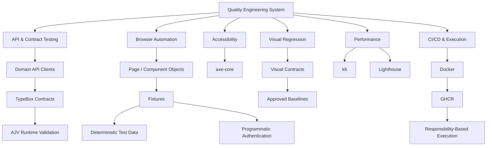

# Quality Engineering Architecture

## Purpose

This document describes the public architecture view of the Quality Engineering framework behind this showcase.

The framework is designed as an **engineering system rather than a collection of independent test scripts**.

Its architecture is built around several principles:

- clear responsibility boundaries;
- deterministic and reusable test setup;
- runtime validation at external system boundaries;
- separation of test intent from infrastructure;
- execution appropriate to the quality concern being measured;
- reproducible environments;
- actionable diagnostics;
- reuse of existing framework capabilities before introducing new abstractions.

This document intentionally focuses on architectural responsibilities and engineering decisions rather than exposing the complete internal implementation.

---

## System Overview



The architecture separates reusable infrastructure from the tests that consume it.

Individual test suites therefore express **what behavior or quality characteristic is being evaluated**, while shared framework layers own reusable setup, data, authentication, contracts, and execution concerns.

---

## Architectural Layers

At a high level, the framework can be viewed as several cooperating layers:

```text
Tests / Quality Scenarios
          ↓
Reusable Domain Abstractions
          ↓
Fixtures & Deterministic State
          ↓
Clients / Browser / Validation
          ↓
Configuration & Execution Environment
          ↓
Application Under Test
```

These layers are intentionally not interchangeable.

Tests should describe behavior.

Page and Component Objects encapsulate browser-facing behavior.

API clients encapsulate domain-level HTTP interaction.

Fixtures compose reusable capabilities and lifecycle responsibilities.

Factories create deterministic data.

Schemas define external response contracts.

CI and Docker provide reproducible execution boundaries.

This separation keeps scenario code focused while infrastructure remains reusable across multiple quality responsibilities.

---

## API & Contract Architecture

API automation is treated as a first-class testing responsibility rather than browser setup hidden inside UI tests.

The general interaction model is:

```text
Test / Fixture
     ↓
Domain API Client
     ↓
HTTP Request
     ↓
Provider Response
     ↓
Status Validation
     ↓
Runtime Contract Validation
     ↓
Typed Result
     ↓
Business Assertions
```

### Domain API Clients

Domain clients encapsulate reusable interaction with application APIs.

Tests should not repeatedly reconstruct low-level request behavior when the same domain capability already exists.

This provides a reusable boundary for:

- API-focused tests;
- deterministic test setup;
- lifecycle operations;
- authentication-related setup;
- UI scenarios that require application state but do not need to create that state through the browser.

### Schema-First Runtime Validation

TypeScript provides compile-time guarantees about code written inside the framework.

It does not guarantee that an external provider returned the structure expected at runtime.

The framework therefore validates successful API responses before trusting them:

```text
response
   ↓
expected status
   ↓
parse payload
   ↓
AJV validation against TypeBox schema
   ↓
typed application data
```

TypeBox provides the relationship between runtime schemas and TypeScript types.

AJV validates the actual provider response.

This creates an explicit contract boundary between the automation system and the external API.

---

## Browser Automation Architecture

Browser-facing automation separates scenario intent from reusable interface behavior.

```text
UI Test
   ↓
Fixture
   ↓
Page Object
   ↓
Component Object
   ↓
Playwright
   ↓
Browser
```

### Page Objects

Page Objects represent behavior associated with a page or major application surface.

They provide reusable operations and meaningful application-level interactions rather than exposing raw selectors throughout tests.

### Component Objects

Reusable interface components can be represented independently when they have meaningful behavior of their own.

This prevents Page Objects from becoming large containers for every selector and interaction visible on a screen.

The distinction is based on responsibility, not on creating abstractions for their own sake.

### Assertion Boundaries

Reusable objects provide interaction and domain-oriented behavior, while tests retain ownership of scenario-specific expectations where appropriate.

This keeps the reason for a test failure visible at the scenario level instead of hiding all verification inside infrastructure.

---

## Fixtures & Lifecycle Composition

Fixtures form the composition layer between test scenarios and reusable framework capabilities.

Conceptually:

```text
Scenario
   ↓
Fixture Composition
   ├── Authentication
   ├── Page / Component Access
   ├── API Capabilities
   ├── Deterministic Test Data
   └── Lifecycle Management
```

Fixtures are used to provide already-prepared capabilities to tests rather than forcing every scenario to rebuild setup logic.

The complete internal fixture graph is intentionally not reproduced in this public showcase.

The architectural principle is more important:

> **Tests consume capabilities; fixtures compose them.**

This supports consistent initialization and makes ownership of setup and cleanup easier to reason about.

---

## Deterministic Test Data

Test data is treated as infrastructure.

Factories provide controlled input generation instead of scattering arbitrary values throughout tests.

```text
Scenario Requirements
        ↓
Deterministic Factory
        ↓
Known Test Data
        ↓
Fixture / API Setup
        ↓
Known Application State
```

Deterministic data improves:

- reproducibility;
- debugging;
- isolation;
- failure investigation;
- reuse across API and browser scenarios.

Where application state can be created through an existing API capability, browser tests can reuse that capability instead of reproducing setup through UI interactions.

---

## Authentication Architecture

Authentication is separated from the business behavior being tested whenever authentication itself is not the scenario under test.

The framework supports programmatic authentication patterns for both API and browser execution.

Conceptually:

```text
Authentication Capability
          ↓
Valid Authenticated State
          ↓
Fixture
          ↓
Scenario
```

This avoids repeatedly exercising login UI as setup for unrelated scenarios.

The public showcase intentionally does not expose credentials, tokens, cookies, session state, environment-specific authentication details, or reusable secrets.

---

## Network Mocking

The framework can isolate selected browser behavior through controlled network mocking when the scenario requires deterministic provider behavior.

The intent is not to replace integration coverage.

Instead, mocking is used where controlled responses are necessary to exercise a specific browser-side behavior reliably.

```text
Browser Scenario
       ↓
Controlled Network Boundary
       ↓
Deterministic Response
       ↓
Expected UI Behavior
```

Real API coverage and mocked UI behavior therefore serve different testing responsibilities.

---

## Cross-Browser Execution

Browser coverage is assigned according to responsibility.

API tests are browser-independent and therefore do not need to be multiplied across browser engines.

Browser behavior is exercised across:

```text
Chromium
Firefox
WebKit
```

The ownership model is:

```text
API
→ execute once

UI
→ Chromium
→ Firefox
→ WebKit
```

This provides meaningful browser coverage without paying for redundant API execution.

---

## Accessibility Architecture

Accessibility testing is a dedicated quality responsibility rather than a side effect of the normal UI browser matrix.

```text
Deterministic Page State
        ↓
Accessibility Scenario
        ↓
axe-core Analysis
        ↓
Policy / Assertions
        ↓
Evidence
```

Automated accessibility analysis provides repeatable detection of supported accessibility rules.

It is **not presented as proof of complete WCAG conformance**.

Automated checks are one quality signal within a broader accessibility strategy.

---

## Visual Regression Architecture

Visual regression is treated as a deterministic rendering contract.

```text
Deterministic State
        ↓
Canonical Rendering Environment
        ↓
Current Screenshot
        ↓
Approved Baseline
        ↓
Comparison
        ↓
Pass / Review Required
```

The framework uses Playwright screenshot assertions with version-controlled approved baselines.

### Baseline Ownership

A changed screenshot does not automatically become the new expected result.

The baseline represents an explicitly approved rendering state.

This means CI consumes visual contracts; it does not silently redefine them.

### Canonical Environment

Rendering can vary across operating systems, fonts, browser versions, and runtime environments.

Visual execution therefore uses a controlled Docker/Linux environment as the canonical rendering boundary.

This makes screenshot comparison reproducible between approved baseline generation and CI execution.

---

## Performance Architecture

Performance testing is divided according to what is being measured.

```text
Performance
├── API Workload Performance
│   └── k6
│
└── Browser Performance
    └── Lighthouse
```

### API Performance — k6

k6 owns API workload-oriented performance testing.

Its responsibility is different from browser automation and therefore does not need to run through Playwright.

### Browser Performance — Lighthouse

Lighthouse owns browser-observed performance measurements.

The framework supports two complementary paths:

```text
Browser Performance
├── Standalone Lighthouse
└── Authenticated Playwright + Lighthouse
```

Standalone execution measures a directly accessible page.

Authenticated execution uses Playwright when deterministic authenticated business state is required before measurement.

### Reusing Functional Setup

Performance coverage does not introduce a second business-state initialization model when the functional framework already owns deterministic setup.

The governing pattern is:

```text
Existing Fixture / API Setup
          ↓
Deterministic Business State
          ↓
Authenticated Browser State
          ↓
Lighthouse Measurement
```

Only the measurement layer changes.

### Repeated Measurement

Browser performance is inherently variable.

Authenticated Lighthouse execution therefore uses multiple independent measurements and aggregates metrics before evaluating the shared performance policy.

This reduces dependence on a single potentially noisy browser run.

---

## Execution Ownership

A central architectural principle is that **execution follows responsibility**.

```text
Capability             Execution Responsibility
─────────────────────────────────────────────────
API                    Browser-independent
UI                     Cross-browser
Accessibility          Dedicated browser quality check
Visual Regression      Canonical rendering environment
API Performance        k6
Browser Performance    Lighthouse + Chromium
```

This is deliberately different from running every test against every available execution target.

The objective is meaningful coverage with explicit ownership.

---

## Docker & Reproducibility

Docker provides a controlled execution boundary for the framework.

It helps align:

- runtime dependencies;
- Playwright/browser versions;
- CI execution;
- visual rendering;
- repeatable test environments.

Docker is therefore part of the framework architecture rather than only a packaging mechanism.

```text
Source
  ↓
Container Image
  ↓
Known Runtime
  ↓
Quality Responsibility
```

---

## CI/CD Architecture

The primary CI model follows a **build once, run many** approach.

```text
quality
├── formatting
└── typecheck
        ↓
build-image
        ↓
publish commit-SHA image
        ↓
GHCR
        ↓
        ├── API
        ├── Accessibility
        ├── Visual Regression
        └── UI Browser Matrix
              ├── Chromium
              ├── Firefox
              └── WebKit
```

The container image is associated with the workflow commit and reused by downstream execution responsibilities.

This avoids rebuilding independent runtime environments for each test responsibility.

The container provides the environment.

The Playwright project and CI job provide the execution responsibility.

Performance testing has separate workflow ownership because its runtime and environmental constraints differ from the standard functional pipeline.

For more detail, see [CI/CD](CI_CD.md).

---

## Diagnostics

Failure evidence is part of framework design.

Depending on execution context, Playwright diagnostics can include:

- HTML reports;
- traces;
- screenshots;
- retained video;
- execution artifacts.

Performance tooling produces its own measurement evidence.

The purpose of diagnostics is not merely artifact generation.

Evidence should help answer:

```text
What failed?
Where did it fail?
What state was the system in?
Can the failure be reproduced?
Is this a product, test, environment, or infrastructure problem?
```

Public demo evidence is reviewed separately before publication and does not expose raw private execution artifacts by default.

---

## Engineering Principles

### Discover → Reuse → Extend → Create

Before introducing a new abstraction:

```text
Discover existing capability
          ↓
Can it be reused?
          ↓
Can it be safely extended?
          ↓
Only then create something new
```

This prevents parallel implementations of the same responsibility and keeps the framework coherent as it grows.

### Separate Behavior from Infrastructure

Tests should primarily communicate the behavior being evaluated.

Reusable infrastructure owns common setup, data, authentication, API interaction, and environment concerns.

### Prefer Deterministic Initialization

If business state can be initialized deterministically through an existing framework capability, reuse that capability rather than rebuilding the state through unrelated UI steps.

### Validate External Boundaries

Static typing is not a substitute for runtime validation of external data.

### Make Execution Ownership Explicit

Different quality concerns have different execution requirements.

Architecture should express those differences rather than hiding them behind a universal execution model.

### Treat Evidence as an Engineering Output

Reports, traces, screenshots, visual comparisons, accessibility findings, and performance measurements exist to support diagnosis and engineering decisions.

---

## Public Showcase Boundary

This repository is a curated representation of the architecture.

It intentionally does not publish the complete internal framework.

Public material is selected to demonstrate:

- architecture;
- representative implementation patterns;
- engineering decisions;
- execution ownership;
- real reviewed evidence.

Sensitive or unnecessarily operational details remain outside the public showcase.

This includes, among other things:

- credentials and secrets;
- authentication tokens and session data;
- private environment configuration;
- complete internal fixture composition;
- unreviewed raw execution artifacts.

The objective is to expose enough implementation and reasoning to evaluate the engineering approach without turning the showcase into a second independently maintained copy of the canonical framework.

---

## Related Documentation

- [CI/CD](CI_CD.md)
- [Engineering Decisions](ENGINEERING_DECISIONS.md)
- [Testing Standards](TESTING_STANDARDS.md)
- [Framework Roadmap](ROADMAP.md)

← [Back to Quality Engineering Showcase](../README.md)