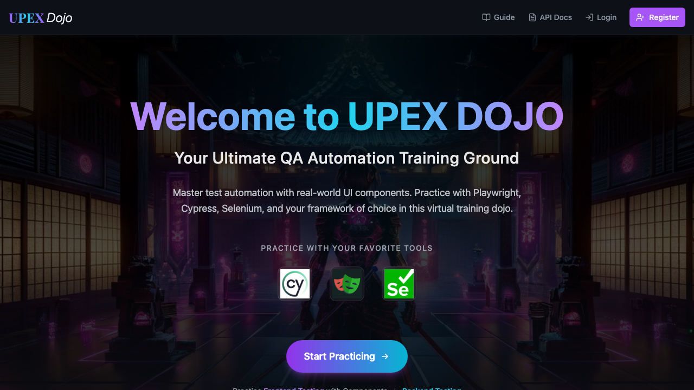
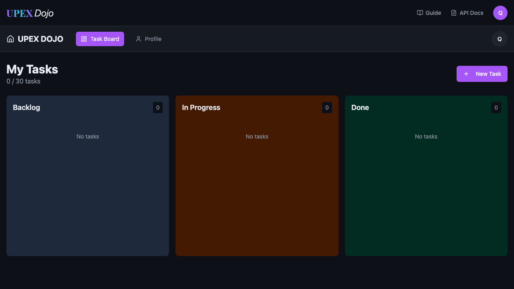

# Accessibility Execution Evidence

This evidence demonstrates automated accessibility validation against both public and authenticated application states using the canonical framework implementation.

The execution was performed locally against the same accessibility project and test architecture used by the private canonical framework.

## Execution Summary

| Attribute | Result |
| --- | --- |
| Test layer | Accessibility |
| Execution | Playwright + axe-core |
| Coverage | Public home page and authenticated dashboard |
| Policy | WCAG 2.2 Level AA automated rule set |
| Tests executed | 2 |
| Retries | 0 |
| Result | 2 expected quality-gate failures |
| Detected rule | `color-contrast` |
| Impact | `serious` |
| Observed contrast | `3.81:1` |
| Required contrast | `4.5:1` |

The failures represent a detected product accessibility defect rather than a framework or infrastructure failure.

No accessibility rule was suppressed to make the execution pass.

## Public Page Detection

The public home-page scan detected insufficient contrast on the **Register** navigation element.

```text
Rule:     color-contrast
Impact:   serious
Target:   .bg-primary > span
Actual:   3.81:1
Required: 4.5:1
```



The automated scan identified that the foreground and background color combination does not meet the required minimum contrast ratio.

## Authenticated Page Detection

The authenticated dashboard scan independently detected the same contrast problem on the active **Task Board** navigation element.

```text
Rule:     color-contrast
Impact:   serious
Target:   a[data-testid="nav-task-board"]
Actual:   3.81:1
Required: 4.5:1
```



This execution also demonstrates that accessibility validation is not limited to publicly accessible pages. The framework can reuse authenticated application state and apply the same accessibility policy after authentication.

## Quality-Gate Behavior

The accessibility tests expect the axe violation collection to be empty.

A detected violation therefore fails the test instead of being converted into informational output or silently ignored.

Conceptually:

```text
Page state
    ↓
Accessibility scan
    ↓
WCAG policy evaluation
    ↓
Violations returned
    ↓
Zero-violation assertion
    ↓
Quality gate fails on detected defect
```

This distinction is important: a red accessibility execution is not automatically a test-framework regression.

In this execution, the framework behaved as designed and surfaced a reproducible product accessibility issue.

## Execution Report

A sanitized copy of the real Playwright HTML report is included with this evidence:

[`playwright-report/index.html`](./playwright-report/index.html)

The report was generated from the real local execution and sanitized before publication to remove environment-specific or generated runtime information that is not relevant to the engineering evidence.

The original canonical framework and original local execution artifacts were not modified during sanitization.

## Evidence Policy

Only sanitized execution evidence is published here.

The showcase does not publish raw runtime artifacts containing unnecessary local environment or generated test-user information.

This evidence is intended to demonstrate:

- automated WCAG-oriented accessibility validation,
- coverage of public and authenticated application states,
- actionable axe diagnostics,
- deterministic quality-gate behavior,
- and root-cause-aware interpretation of failed executions.

The failure shown here is intentionally preserved as evidence of defect detection rather than converted into an artificial passing result.