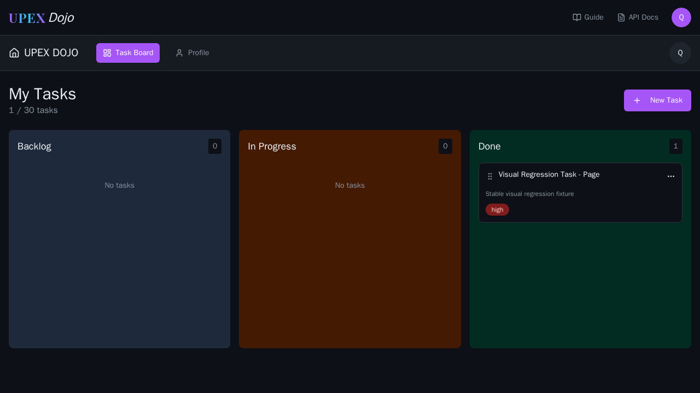
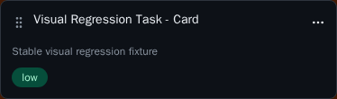

# Visual Regression Execution Evidence

This showcase demonstrates visual regression validation against approved, version-controlled baselines using the canonical framework implementation.

The execution was performed in the canonical Linux-based Playwright environment so the rendering platform matches the approved snapshot baseline.

## Execution Summary

| Attribute | Result |
| --- | --- |
| Test layer | Visual regression |
| Execution | Playwright screenshot comparison |
| Rendering environment | Linux / Playwright container |
| Coverage | Authenticated dashboard and task-card component |
| Tests executed | 2 |
| Result | Passed |
| Baseline ownership | Version-controlled canonical snapshots |
| Comparison policy | Animations disabled · caret hidden |

The successful execution confirms that the current rendered UI matches the approved visual baselines for the covered states.

## Canonical Baselines

The approved baseline images originate from the canonical private framework and are maintained alongside the visual specification.

### Authenticated Dashboard



This baseline represents the authenticated dashboard after deterministic test data has been created through the API layer.

The visual assertion is performed against the complete page.

### Task Card Component



This baseline represents an individual task-card component created with deterministic fixture data.

The component-level comparison demonstrates that visual checks can be scoped below the full-page level when a smaller UI boundary provides more useful regression signal.

## Deterministic Test State

The visual scenarios do not depend on manually prepared application state.

Before each comparison, the framework creates controlled task data through the API layer, navigates to the authenticated dashboard, and verifies that the expected UI state is visible before performing the screenshot assertion.

Conceptually:

```text
Deterministic test data
        ↓
API state setup
        ↓
Authenticated page state
        ↓
UI readiness assertion
        ↓
Screenshot capture
        ↓
Approved baseline comparison
        ↓
Visual regression gate
```

This reduces false visual differences caused by inconsistent or manually prepared test state.

## Comparison Stability

The canonical comparison configuration disables animations and hides the text caret:

```text
animations: disabled
caret:      hidden
```

These controls reduce rendering noise while preserving meaningful visual differences.

The objective is not to eliminate legitimate changes, but to remove transient browser behavior that would otherwise make screenshot comparison unnecessarily unstable.

## Baseline Ownership

The source-of-truth visual baselines are version controlled with the canonical visual test implementation.

The showcase copies shown here are evidence only.

Baseline updates are not performed in the public showcase repository.

A baseline should change only when a visual change has been intentionally reviewed and approved in the canonical framework.

## Successful Gate Behavior

This execution passed because the current screenshots matched the approved baselines.

No `actual`, `expected`, or `diff` mismatch artifacts were generated because Playwright only produces those diagnostic artifacts when a screenshot comparison fails.

A successful execution therefore demonstrates the other half of visual regression testing:

```text
Approved baseline
        +
Current deterministic rendering
        ↓
Pixel comparison
        ↓
No unexpected difference
        ↓
PASS
```

A future genuine mismatch would cause the same test layer to fail and produce comparison diagnostics rather than silently accepting the change.

## Execution Report

A sanitized copy of the real Playwright HTML report is published with this showcase:

[Open the rendered Playwright report](https://szabihudak.github.io/quality-engineering-showcase/showcases/visual-regression/playwright-report/)

The sanitized report source is retained under:

[`playwright-report/`](./playwright-report/)

The report originates from the real canonical visual-regression execution. Environment-specific or generated runtime information that is not relevant to the engineering evidence should be removed before publication.

## Evidence Policy

This showcase publishes only public-safe evidence derived from the canonical implementation.

It does not publish or maintain an independent visual regression framework.

The evidence demonstrates:

- version-controlled visual baseline ownership;
- deterministic API-driven test-state setup;
- authenticated visual coverage;
- full-page and component-level comparisons;
- rendering-noise controls;
- canonical Linux execution;
- and real successful visual-regression gate behavior.

The baseline images included here are evidence copies of the canonical approved snapshots, not independently generated showcase assets.